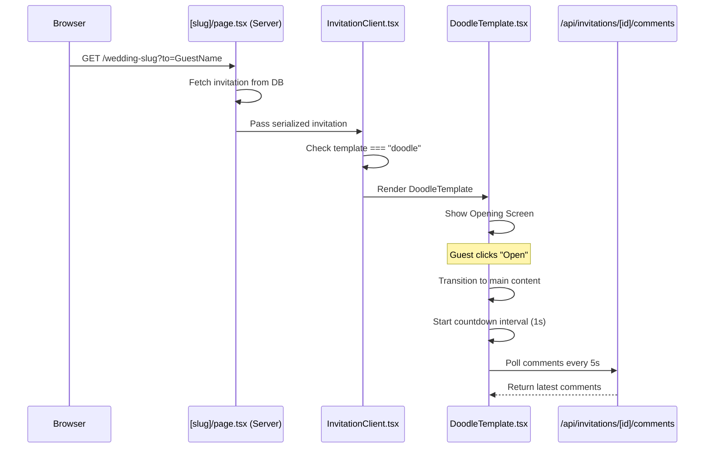

# Design Document: Doodle Theme

## Overview

The Doodle theme is a new wedding invitation template that delivers a whimsical, hand-drawn/sketch-style aesthetic. It replaces the existing Garden theme and integrates into the existing template routing system in `InvitationClient.tsx`. The template uses a beige/cream background (#F5F0E8) with emerald green accents (#047857), hand-drawn SVG decorations, hand-written Google Fonts (Caveat, Patrick Hand), and a playful couple illustration.

The implementation follows the established template pattern: a single self-contained React component (`DoodleTemplate.tsx`) that accepts `{ invitation: SerializedInvitation, guestName?: string | null }` props and renders all invitation sections with its own opening screen, animations, and styling.

### Key Design Decisions

1. **Self-contained template component**: Like SpotifyTemplate and FloralTemplate, DoodleTemplate manages its own opening screen, state, and all sections internally rather than using shared sub-components. This keeps templates independent and easy to maintain.

2. **Inline SVG decorations**: All hand-drawn decorations are inline SVG elements within the component (not external files). This ensures zero additional network requests and allows dynamic coloring via `currentColor`.

3. **Google Fonts via next/font**: Fonts are loaded using Next.js `next/font/google` for optimal performance (automatic font subsetting, self-hosting, zero layout shift).

4. **Garden theme removal**: The Garden template is deleted and its routing entry removed. Invitations with `template="garden"` fall through to the default elegant template.

## Architecture

```mermaid
graph TD
    A[InvitationClient.tsx] -->|template === "doodle"| B[DoodleTemplate.tsx]
    A -->|template === "spotify"| C[SpotifyTemplate.tsx]
    A -->|template === "floral"| D[FloralTemplate.tsx]
    A -->|default / "elegant" / "garden"| E[Inline Elegant Template]
    
    B --> F[Opening Screen]
    B --> G[Quote/Ayat Section]
    B --> H[Couple Profiles]
    B --> I[Countdown]
    B --> J[Events]
    B --> K[Gallery]
    B --> L[Love Story]
    B --> M[Gift Section]
    B --> N[Comments/RSVP]
    B --> O[Share & Footer]
    B --> P[MusicPlayer Component]
    
    style B fill:#F5F0E8,stroke:#047857,stroke-width:2px
```

### File Changes

| Action | File Path | Description |
|--------|-----------|-------------|
| CREATE | `src/components/templates/DoodleTemplate.tsx` | New Doodle theme component |
| MODIFY | `src/app/(public)/[slug]/InvitationClient.tsx` | Add doodle routing, remove garden import/routing |
| DELETE | `src/components/templates/GardenTemplate.tsx` | Remove Garden theme |
| MODIFY | `src/app/api/invitations/[id]/template/route.ts` | Replace "garden" with "doodle" in VALID_TEMPLATES |
| MODIFY | `src/app/(dashboard)/dashboard/[id]/edit/page.tsx` | Replace garden option with doodle in template picker |

## Components and Interfaces

### DoodleTemplate Component

```typescript
// src/components/templates/DoodleTemplate.tsx
"use client";

interface DoodleTemplateProps {
  invitation: SerializedInvitation;
  guestName?: string | null;
}

export default function DoodleTemplate({ invitation, guestName }: DoodleTemplateProps) {
  // Manages opening screen state, countdown timer, comments polling,
  // gallery lightbox, clipboard operations, and form validation
}
```

### Internal Sub-Components (within DoodleTemplate.tsx)

| Component | Purpose |
|-----------|---------|
| `DoodleOpeningScreen` | Full-viewport cover with couple illustration, guest name, and open button |
| `DoodleDivider` | Hand-drawn wavy/sketchy SVG line separator between sections |
| `DoodleCountdown` | Live countdown with hand-drawn box containers |
| `DoodleGallery` | Photo grid with hand-drawn frames and lightbox |
| `DoodleLoveStory` | Vertical timeline with hand-drawn connectors |
| `DoodleComments` | Comment form and display with hand-drawn styling |
| `CoupleIllustration` | SVG of couple holding heart with event date |
| `CornerRibbon` | Corner decoration SVG |
| `DoodleHeart` | Small heart accent SVG (16-32px) |
| `LeafDoodle` | Botanical leaf accent SVG |
| `SketchyBorder` | Reusable hand-drawn rectangle border SVG |
| `WavyBorderButton` | Button with irregular/wavy border effect |

### SVG Decoration Strategy

All decorations use emerald green (#047857) stroke with no fill, stroke-width 1-2px:

```typescript
// Common SVG props for all decorations
const decorationProps = {
  "aria-hidden": "true" as const,
  role: "presentation" as const,
  stroke: "#047857",
  fill: "none",
  strokeWidth: 1.5,
};
```

### Template Router Integration

```typescript
// In InvitationClient.tsx - add before the default elegant template
import DoodleTemplate from "@/components/templates/DoodleTemplate";

// Template routing: render Doodle template if selected
if (invitation.template === "doodle") {
  return <DoodleTemplate invitation={invitation} guestName={guestName} />;
}

// Remove: import GardenTemplate and its routing block
// "garden" falls through to default elegant template
```

### Font Loading

```typescript
import { Caveat, Patrick_Hand } from "next/font/google";

const caveat = Caveat({
  subsets: ["latin"],
  weight: ["400", "700"],
  variable: "--font-caveat",
});

const patrickHand = Patrick_Hand({
  subsets: ["latin"],
  weight: "400",
  variable: "--font-patrick-hand",
});
```

### Color Constants

```typescript
const COLORS = {
  background: "#F5F0E8",      // Beige/cream
  accent: "#047857",          // Emerald green
  accentDark: "#065F46",      // Dark emerald (headings)
  text: "#374151",            // Dark gray (body)
  textLight: "#6B7280",       // Light gray (secondary)
  white: "#FFFFFF",
} as const;
```

## Data Models

No database schema changes are required. The Doodle template uses the existing `Invitation` model and its relations (`Gallery`, `Comment`, `GiftAccount`, `LoveStory`). The `template` field already supports arbitrary string values with validation in the API route.

### Data Flow



### SerializedInvitation Interface (existing, no changes)

The template consumes the existing `SerializedInvitation` interface exported from `InvitationClient.tsx`, which includes all invitation fields, gallery photos, comments, gift accounts, and love stories as serialized JSON.

## Correctness Properties

*A property is a characteristic or behavior that should hold true across all valid executions of a system — essentially, a formal statement about what the system should do. Properties serve as the bridge between human-readable specifications and machine-verifiable correctness guarantees.*

### Property 1: Conditional section visibility based on data presence

*For any* valid invitation data, sections with empty data arrays (gallery with 0 photos, gift accounts with 0 entries, love stories with 0 entries) SHALL NOT be rendered in the DOM, and sections with non-empty data SHALL be rendered.

**Validates: Requirements 9.6, 10.1, 11.6**

### Property 2: Guest name conditional display

*For any* non-empty guest name string, the opening screen SHALL display "Kepada" followed by the guest name; *for any* null or empty guest name, the opening screen SHALL NOT render the guest name section.

**Validates: Requirements 3.5, 3.6**

### Property 3: Couple name display with fullName fallback

*For any* invitation data, the displayed name for each person SHALL equal their `fullName` field when it is non-null, or their `name` field when `fullName` is null.

**Validates: Requirements 6.4**

### Property 4: Parent info conditional display

*For any* invitation data, the parent information subsection for a profile SHALL be rendered if and only if at least one of (father, mother, childOrder) fields is provided for that profile.

**Validates: Requirements 6.5, 6.6**

### Property 5: Countdown calculation correctness

*For any* future date, the countdown function SHALL produce values where `days * 86400 + hours * 3600 + minutes * 60 + seconds` equals the floor of the total seconds remaining until that date (±1 second tolerance). *For any* past date, the countdown SHALL return `isPast: true` with all values at zero.

**Validates: Requirements 7.1, 7.5**

### Property 6: Event date formatting in Indonesian locale

*For any* valid Date object, the formatted date string SHALL match the pattern `"DayName, D MonthName YYYY"` where DayName is an Indonesian weekday name and MonthName is an Indonesian month name.

**Validates: Requirements 8.2**

### Property 7: Event time formatting

*For any* start time string and optional end time string, the formatted output SHALL be `"HH:MM - HH:MM WIB"` when both are provided, or `"HH:MM WIB"` when only start time is provided.

**Validates: Requirements 8.3**

### Property 8: Calendar event generation preserves invitation data

*For any* valid invitation with event date, time, and location, the generated calendar event (Google Calendar URL or ICS content) SHALL contain the wedding title (groom & bride names), the correct event date, the time range, and the venue location.

**Validates: Requirements 8.6**

### Property 9: Love story ordering

*For any* array of love stories, the rendered timeline SHALL display stories in ascending order of their `order` field.

**Validates: Requirements 10.1**

### Property 10: Comments ordering

*For any* array of comments, the displayed list SHALL be ordered from newest to oldest based on the `createdAt` timestamp.

**Validates: Requirements 12.3**

### Property 11: Form validation rejects empty required fields

*For any* form submission where the name field is empty OR the message field is empty, the system SHALL display an inline validation error and SHALL NOT clear the other filled fields.

**Validates: Requirements 12.5**

### Property 12: Share URL construction

*For any* invitation URL, the WhatsApp share URL SHALL contain the URL-encoded invitation URL in its message parameter, and the Telegram share URL SHALL contain the URL-encoded invitation URL in its url parameter.

**Validates: Requirements 13.3, 13.4**

### Property 13: Conditional element rendering based on data presence

*For any* invitation data: the MusicPlayer SHALL render if and only if `musicUrl` is non-null; the hashtag SHALL render if and only if `hashtag` is non-null; the "Buka Maps" button SHALL render if and only if the corresponding maps URL is non-null; the QRIS image SHALL render if and only if `qrisUrl` is non-null.

**Validates: Requirements 15.1, 15.2, 13.7, 8.5, 11.4**

## Error Handling

| Scenario | Handling Strategy |
|----------|-------------------|
| Google Fonts fail to load | Fallback to system serif stack (Georgia, "Times New Roman", serif) via CSS font-family |
| Gallery image fails to load | Show a placeholder with doodle-style broken image icon |
| Comment submission fails (network error) | Display inline error message "Gagal mengirim, coba lagi" without clearing form |
| Comment polling fails | Silently retry on next interval; do not show error to user |
| Clipboard API unavailable | Fallback to `document.execCommand('copy')` or show manual copy instruction |
| Browser blocks audio autoplay | MusicPlayer shows paused state; user can manually start |
| Invalid/missing event date | Hide countdown section; show events section without countdown |
| Maps URL is malformed | Still render the button; browser handles the navigation |

## Testing Strategy

### Unit Tests (Vitest + React Testing Library)

Focus on specific examples and edge cases:

- Template router correctly routes `template="doodle"` to DoodleTemplate
- Template router renders default elegant for `template="garden"` (fallback)
- Opening screen renders guest name when provided
- Opening screen hides guest name when absent
- Countdown displays "Acara telah berlangsung" for past dates
- Copy button triggers clipboard API with correct account number
- Form validation shows error for empty name/message
- Gallery lightbox opens on photo click and closes on outside click
- Share buttons construct correct WhatsApp/Telegram URLs
- VALID_TEMPLATES includes "doodle" and excludes "garden"

### Property-Based Tests (Vitest + fast-check)

Property-based testing is appropriate for this feature because several core behaviors are pure functions with clear input/output relationships that vary meaningfully with input (countdown calculation, date formatting, time formatting, calendar event generation, conditional rendering logic).

**Library**: `fast-check` (JavaScript property-based testing library)
**Configuration**: Minimum 100 iterations per property test
**Tag format**: `Feature: doodle-theme, Property {number}: {property_text}`

Properties to implement:
1. Conditional section visibility (Property 1)
2. Guest name conditional display (Property 2)
3. Couple name fullName fallback (Property 3)
4. Parent info conditional display (Property 4)
5. Countdown calculation correctness (Property 5)
6. Event date Indonesian locale formatting (Property 6)
7. Event time formatting (Property 7)
8. Calendar event data preservation (Property 8)
9. Love story ordering (Property 9)
10. Comments ordering (Property 10)
11. Form validation (Property 11)
12. Share URL construction (Property 12)
13. Conditional element rendering (Property 13)

### Visual/Manual Testing

- Responsive layout at 320px, 768px, 1024px, 1920px viewports
- WCAG AA contrast ratio verification for all color pairs
- SVG decorations do not overlap interactive elements
- Touch targets meet 44x44px minimum on mobile
- Font rendering with Caveat and Patrick Hand
- Animation smoothness (framer-motion scroll triggers)
- Music autoplay behavior across browsers (Chrome, Safari, Firefox)

### Accessibility Testing

- All SVG decorations have `aria-hidden="true"` and `role="presentation"`
- Form inputs have associated labels
- Buttons have descriptive text
- Color contrast meets WCAG AA (4.5:1 normal text, 3:1 large text)
- Keyboard navigation works for all interactive elements
- Screen reader announces section headings correctly
